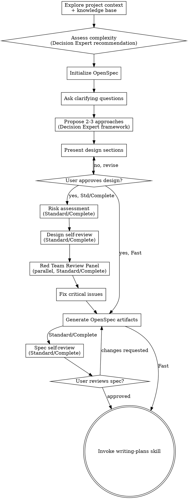

# Brainstorming Ideas Into Designs

Help turn ideas into fully formed designs and specs through natural collaborative dialogue.

对 L2+，先理解项目上下文，再按风险提出必要问题并形成设计契约。L1 使用简短假设和验收说明，不展开完整设计流程。

<HARD-GATE>
L1+ 行为或功能变更，在完成与其风险相称的设计说明前，不要进入实现。L0 的机械性改动不调用本技能，直接修改并聚焦验证。
</HARD-GATE>

## Five-Level Process System（五级流程体系）

PowersNexus uses a 5-level process system. The task-size-assessor skill automatically evaluates the task and recommends the appropriate level.

| Level | Name | Use Case | Core Steps | Docs Output | Est. Time |
|-------|------|----------|------------|-------------|-----------|
| **L0** | Micro Fix | typo, config, copy | Change → Verify → Commit | None | < 5 min |
| **L1** | Quick Fix | small features, bug fixes | 简短假设 → 实现 → 测试 | 简短验收说明 | < 30 min |
| **L2** | Standard | medium features, modules | 设计契约 + 计划 + 审查 + 测试 | design + tasks | 1-2 hrs |
| **L3** | Full Process | large features, architecture | Full OpenSpec + Red Team | full docs | 4-8 hrs |
| **L4** | Heavyweight | core architecture, major refactor | L3 + multi-review + user approval | full + review records | 1 day+ |

**Assessment trigger:** L2+ 在 brainstorming 开始时调用 task-size-assessor；L1 可使用 CLI 快速评估，不再额外加载完整评估技能。

## 渐进执行规则

- **L0**：不要调用本技能。直接修改、运行聚焦验证、简要说明结果。
- **L1**：只在缺少关键事实时询问一次；以一段假设、范围和验收条件代替完整工件。无需红队审查、OpenSpec 初始化或重复批准。
- **L2**：一次设计契约后进入计划；保留必要的风险、审查和测试。
- **L3/L4**：按完整流程执行。L4 增加多轮审查和明确用户批准。

## Anti-Pattern: "This Is Too Simple To Need A Design"

L1+ 项目都需要与风险相称的设计。L0 的文案、配置和机械性微调不进入本技能；它们以变更说明和聚焦验证替代设计工件。

**L1 例外：** 设计可以只有几行。若用户目标和验收条件已明确，可记录假设后直接实施；仅在关键选择未明确时请求一次澄清。

## Checklist（仅 L2+）

L1 已按“渐进执行规则”完成简短假设后直接进入实现和聚焦测试；不要执行下列完整清单。L2+ 为每项创建任务并按顺序完成：

### Phase 0: Project Assessment
1. **Explore project context** — check files, docs, recent commits, knowledge base
2. **Task size assessment** — invoke task-size-assessor skill to evaluate task and recommend L0-L4 process level；若已有自动本地交付授权，记录评估和关键假设后连续推进，不重复请求阶段批准

   **Quick CLI shortcut (optional):**
   You can use the PowersNexus CLI for a quick initial assessment:
   ```bash
   node src/cli/powersnexus-cli.js start "<task description>"
   ```
   Or: `powersnexus start "<task description>"`
   
   The CLI provides a quick level recommendation. Then follow up with the full task-size-assessor skill for detailed analysis.

3. **Module existence check** — for each target module, check if `.novaway/powersnexus/specs/<module>/spec.md` exists; determine create mode (Greenfield/Brownfield/Mixed)
4. **Initialize OpenSpec** — create `.novaway/powersnexus/changes/<name>/` directory structure (skip for L0/L1)

### Phase 1: Design
4. **Offer the visual companion just-in-time** — NOT upfront. The first time a question would genuinely be clearer shown than described, offer it then (its own message); on approval its browser tab opens for you. If no visual question ever arises, never offer it. See the Visual Companion section below.
5. **Ask clarifying questions** — Use the `question` tool. One question at a time. MAXIMUM 8 questions total. Each question MUST have:
   - 2-4 clear options (multiSelect: false/true)
   - Focus on: purpose, constraints, success criteria
   - Prioritize the most critical questions first
6. **Propose 2-3 approaches** — Use the `question` tool to present approaches with trade-offs and your recommendation (use decision expert framework). User must select one approach before proceeding.
7. **Present design** — in sections scaled to their complexity. 默认在每段后使用 `question` 工具获取批准；已有自动本地交付授权时，在不涉及外部或不可逆操作的前提下记录设计并连续推进，只有关键未知项才提问。

### Phase 2: Quality Assurance
8. **Risk assessment** — identify technical risks, dependencies, and mitigation strategies (Standard/Complete Paths)
9. **Design self-review** — review the design for completeness, consistency, testability, and maintainability (Standard/Complete Paths)
10. **Red team review** — parallel review by security expert, architect, testing expert, performance expert:
    - **Complete Path:** Full panel (all 4 reviewers)
    - **Standard Path:** Simplified panel (architect + testing expert)
    - **Fast Path:** No red team review
11. **Fix critical issues** — address all 🔴 Critical issues from red team review

### Phase 3: Generate Artifacts
12. **Generate OpenSpec artifacts** — create appropriate documents based on selected path:
    - **Fast Path:** design.md + tasks.md
    - **Standard Path:** proposal.md + delta-specs/ + design.md + tasks.md + cross-reference.md
    - **Complete Path:** all artifacts + risk assessment + NFR documentation + red-team-review.md
13. **Initialize delivery contract** — 对 L2+ 创建 `delivery.json`，优先运行 `powersnexus init delivery <change-name> --profile <application|library>`，并把真实 argv、启动冒烟和健康检查要求交给 writing-plans。
14. **Spec self-review** — quick inline check for placeholders, contradictions, ambiguity, scope (Standard/Complete Paths only)
15. **User reviews written spec** — 默认使用 `question` 工具请求审阅；已有自动本地交付授权时记录审阅结论并连续进入 writing-plans，除非存在关键未知项或外部影响。

### Phase 4: Transition to Implementation
16. **Transition to implementation** — invoke writing-plans skill to create implementation plan

## Process Flow（L2+）



**L2+ 的终态是：** UI 工作先调用 `ui-ux-pro-max`，再调用 `frontend-quality`，最后调用 `writing-plans`；非 UI 工作直接调用 `writing-plans`。L1 完成简短假设后直接进入实现和聚焦测试，不加载此完整流程。

## The Process（L2+）

### Project Complexity Assessment

**L2+ 在提出详细问题前评估复杂度：**

```markdown
## Project Complexity Assessment

Based on your description, I've evaluated this project as:

**[Simple / Medium / Complex]**

**Evaluation Criteria:**
- **Scope:** [description]
- **Estimated duration:** [time estimate]
- **Affected modules:** [count]
- **Dependencies:** [list]

**Recommended Workflow:** [Fast Path / Standard Path / Complete Path]

**Options:**
- [ ] Fast Path (推荐) - Quick design + direct implementation
  - Best for: small fixes, single-file changes, < 1 day work
  - Output: brief design + tasks
- [ ] Standard Path - Structured design + implementation
  - Best for: typical features, 1-5 day work, multiple files
  - Output: proposal + delta-specs + design + tasks + cross-reference
- [ ] Complete Path - Full quality assurance
  - Best for: complex systems, > 5 day work, critical features
  - Output: complete artifacts + risk assessment + design review + NFR
- [ ] Other - Custom workflow (please specify)

**Which workflow would you like to use?**
```

**Workflow Definitions:**

| Path | Complexity | Output | Quality Gates |
|------|------------|--------|---------------|
| **Fast Path** | Simple | design.md, tasks.md | User approval |
| **Standard Path** | Medium | Full artifacts | User approval + spec self-review |
| **Complete Path** | Complex | Full artifacts + risk assessment + design review | All gates |

**Auto-detection:**
- If the request is clearly simple (e.g., "fix a typo", "change a color"), auto-select Fast Path
- If the request involves multiple modules or complex logic, auto-select Standard Path
- If the request involves critical systems (auth, payments, security), auto-select Complete Path

**User override:** User can always choose a different path regardless of auto-detection

**After user selection:** Proceed with the appropriate depth of documentation and review.

### Understanding the idea:

- Check out the current project state first (files, docs, recent commits)
- Before asking detailed questions, assess scope: if the request describes multiple independent subsystems (e.g., "build a platform with chat, file storage, billing, and analytics"), flag this immediately. Don't spend questions refining details of a project that needs to be decomposed first.
- If the project is too large for a single spec, help the user decompose into sub-projects: what are the independent pieces, how do they relate, what order should they be built? Then brainstorm the first sub-project through the normal design flow. Each sub-project gets its own spec → plan → implementation cycle.
- For appropriately-scoped projects, use the `question` tool to ask clarifying questions
- **IMPORTANT: MAXIMUM 8 questions total.** You must be sharp and ask only the most critical questions. Avoid trivial or redundant questions.
- **Question format requirements:**
  - Always use `question` tool (NOT plain text)
  - 2-4 clear options per question
  - Set multiSelect to true only when multiple choices make sense
  - One question per tool call
- **Priority order for questions:**
  1. Core functionality scope (what must it do?)
  2. Technical constraints (tech stack, APIs, integrations)
  3. Success criteria (how do we know it's done?)
  4. User experience expectations
  5. Edge cases and error handling
- Focus on understanding: purpose, constraints, success criteria

**Exploring approaches:**

- Propose 2-3 different approaches with trade-offs
- Use the `question` tool to present options with your recommendation and reasoning
- Lead with your recommended option and explain why
- User must select one approach before proceeding

**Presenting the design:**

- Once you believe you understand what you're building, present the design
- Scale each section to its complexity: a few sentences if straightforward, up to 200-300 words if nuanced
- After each section, use the `question` tool to ask "Does this look right so far?" with options: [Approved, Needs changes, Skip to next section]
- Cover: architecture, components, data flow, error handling, testing
- Be ready to go back and revise if user selects "Needs changes"

**Design for isolation and clarity:**

- Break the system into smaller units that each have one clear purpose, communicate through well-defined interfaces, and can be understood and tested independently
- For each unit, you should be able to answer: what does it do, how do you use it, and what does it depend on?
- Can someone understand what a unit does without reading its internals? Can you change the internals without breaking consumers? If not, the boundaries need work.
- Smaller, well-bounded units are also easier for you to work with - you reason better about code you can hold in context at once, and your edits are more reliable when files are focused. When a file grows large, that's often a signal that it's doing too much.

**Working in existing codebases:**

- Explore the current structure before proposing changes. Follow existing patterns.
- Where existing code has problems that affect the work (e.g., a file that's grown too large, unclear boundaries, tangled responsibilities), include targeted improvements as part of the design - the way a good developer improves code they're working in.
- Don't propose unrelated refactoring. Stay focused on what serves the current goal.

## Risk Assessment

After user approves the design and before generating artifacts, conduct a thorough risk assessment. Present the findings to the user as part of the design review.

**Technical Risks:**
- Performance bottlenecks — slow operations, N+1 queries, memory concerns
- Scalability limits — behavior at 10× and 100× load
- Security vulnerabilities — injection risks, auth gaps, data exposure
- Dependency risks — third-party libraries, version constraints, maintenance burden
- Operational complexity — deployment, monitoring, debugging difficulty
- Data integrity — race conditions, consistency guarantees, migration risks

**Dependency Risks:**
- External services — reliability, rate limits, cost
- Internal dependencies — teams/people outside your control
- Timing risks — hard deadlines or time-sensitive integrations

**For each risk identified:**
1. **Likelihood** — Low / Medium / High
2. **Impact** — Low / Medium / High
3. **Mitigation strategy** — what we'll do if it occurs
4. **Early warning signs** — how we'll detect it early

For high-impact/high-likelihood risks, include mitigation steps in the design itself.

**Risk Quantification Standards (Complete Path):**

Use this standardized matrix for risk assessment:

| Likelihood | Condition | Examples |
|------------|-----------|----------|
| High (H) | Historical data shows >50% occurrence in similar projects | New tech stack adoption, complex integrations |
| Medium (M) | Historical data shows 20-50% occurrence | Third-party API usage, moderate complexity |
| Low (L) | Historical data shows <20% occurrence | Standard CRUD operations, well-understood patterns |

| Impact | Condition | Examples |
|--------|-----------|----------|
| High (H) | Affects >10% users or core business functions | Payment failures, authentication issues |
| Medium (M) | Affects 1-10% users or secondary functions | UI rendering issues, notification delays |
| Low (L) | Affects <1% users or edge cases | Log formatting, minor UI tweaks |

**Risk Priority Matrix:**

|          | Impact Low | Impact Medium | Impact High |
|----------|-----------|---------------|-------------|
| **Likelihood Low** | [ ] Very Low | [L] Low | [M] Medium |
| **Likelihood Medium** | [L] Low | [M] Medium | [H] High |
| **Likelihood High** | [M] Medium | [H] High | [C] Critical |

**Action Thresholds:**
- [C] Critical → Must resolve before implementation begins
- [H] High → Must have mitigation plan + early warning
- [M] Medium → Should have mitigation plan
- [L] Low → Acceptable risk, no action needed
- [ ] Very Low → Ignore

## Design Self-Review

After risk assessment and before generating artifacts, review the design with these quality criteria:

**Completeness:**
- Are all requirements from the user's request covered?
- Are edge cases and error conditions addressed?
- Is the failure mode clear for each component?

**Consistency:**
- Do all parts of the design agree with each other?
- Are naming conventions consistent?
- Is data flow coherent (no circular dependencies, no missing inputs)?

**Testability:**
- Can each unit be tested independently?
- Are there clear interfaces for mocking/stubbing?
- Is observability built in (logs, metrics, error reporting)?
- Can acceptance criteria be verified objectively?

**Maintainability:**
- Is the design simple enough for a new team member to understand?
- Are concerns well-separated?
- Is there unnecessary complexity (YAGNI check)?
- Will changes in one area ripple through others?

**Non-functional requirements:**
- Performance — are response times and throughput addressed?
- Scalability — can it handle expected growth?
- Security — are auth, validation, and data protection covered?
- Accessibility — if UI, are a11y standards considered?

Fix any issues found. If significant changes are needed, go back through user approval for the revised design.

## After the Design

**OpenSpec Artifacts Generation:**

After user approves the design, generate all OpenSpec artifacts in `.novaway/powersnexus/changes/<name>/`:

1. **proposal.md** — Intent, scope, and approach (with create mode in Metadata)
2. **delta-specs/** — Delta specs with ADDED/MODIFIED/REMOVED requirements (with mode field in header)
3. **design.md** — Technical approach, architecture decisions, data flow, risk assessment
4. **tasks.md** — Implementation checklist
5. **cross-reference.md** — Document relationship tracking (requirements ↔ tasks ↔ design ↔ files)
6. **Initialize Master Specs (Conditional)**:
   - **Greenfield (A)**: Create master spec at `.novaway/powersnexus/specs/<module>/spec.md` using `master-spec.md` template
   - **Brownfield (B)**: Skip; master spec will be updated during archive
   - **Mixed (C)**: For each new module, create master spec; for existing modules, skip

**Module Existence Check (Phase 0.2.5)**

Before generating artifacts, identify the target module(s) and check their existence:

```bash
for module in ${TARGET_MODULES[@]}; do
  if [ -f ".novaway/powersnexus/specs/${module}/spec.md" ]; then
    echo "EXISTS: ${module}"
  else
    echo "MISSING: ${module}"
  fi
done
```

**Mode determination:**
- All EXIST → 场景 B (Brownfield)
- All MISSING → 场景 A (Greenfield)
- Mixed → 场景 C (Mixed)
- Multiple modules all EXIST → 场景 D (Multi-Brownfield)

**Record mode to:**
- `proposal.md` Metadata: `创建模式: Greenfield/Brownfield/Mixed`
- `delta-specs/<domain>/spec.md` 变更模式段
- `cross-reference.md` 顶部模块状态表（Mixed 模式）

**Artifact generation by mode:**

| 模式 | 主规格 | delta-specs | proposal | cross-reference |
|------|--------|-------------|----------|-----------------|
| A (Greenfield) | ✅ 创建 | ✅ 仅 ADDED 段 | ✅ | ✅ |
| B (Brownfield) | ❌ 不动 | ✅ ADDED/MODIFIED/REMOVED | ✅ | ✅ |
| C (Mixed) | 🟡 部分创建 | 🟡 按 module 独立 | ✅ + 模块状态表 | ✅ + 模块状态表 |

**Documentation:**

- Write the validated design to `.novaway/powersnexus/changes/<name>/design.md`
  - (User preferences for spec location override this default)
- Create `cross-reference.md` to track relationships between all documents
  - Requirements ↔ Tasks mapping
  - Requirements ↔ Design mapping
  - Tasks ↔ Files mapping
  - Acceptance Criteria ↔ Verification mapping
- Use elements-of-style:writing-clearly-and-concisely skill if available
- Commit the design document to git

**Spec Self-Review:**
After writing the spec document, look at it with fresh eyes:

1. **Placeholder scan:** Any "TBD", "TODO", incomplete sections, or vague requirements? Fix them.
2. **Internal consistency:** Do any sections contradict each other? Does the architecture match the feature descriptions?
3. **Scope check:** Is this focused enough for a single implementation plan, or does it need decomposition?
4. **Ambiguity check:** Could any requirement be interpreted two different ways? If so, pick one and make it explicit.

Fix any issues inline. No need to re-review — just fix and move on.

**User Review Gate:**
After the spec review loop passes, use the `question` tool to ask the user to review the written spec before proceeding:

Question options:
- Approved - Proceed to implementation
- Needs changes - I'll revise the spec
- Skip - Move to implementation without review

Wait for the user's response. If they select "Needs changes", make them and re-run the spec review loop. Only proceed once the user approves.

**Implementation:**

- Invoke the writing-plans skill to create a detailed implementation plan
- Do NOT invoke any other skill. writing-plans is the next step.

## Key Principles

- **One question at a time** - Don't overwhelm with multiple questions
- **Use question tool everywhere** - Always use the tool for ANY structured question or user confirmation throughout the entire process (clarifying questions, approach selection, design approval, spec review, etc.)
- **Max 8 clarifying questions** - Be sharp, ask only the most critical during requirements gathering
- **Multiple choice preferred** - Easier to answer than open-ended when possible
- **YAGNI ruthlessly** - Remove unnecessary features from all designs
- **Explore alternatives** - Always propose 2-3 approaches before settling
- **Incremental validation** - Present design, get approval before moving on
- **Be flexible** - Go back and clarify when something doesn't make sense

## Visual Companion

A browser-based companion for showing mockups, diagrams, and visual options during brainstorming. Available as a tool — not a mode. Accepting the companion means it's available for questions that benefit from visual treatment; it does NOT mean every question goes through the browser.

**Offering the companion (just-in-time):** Do NOT offer it upfront. Wait until a question would genuinely be clearer shown than told — a real mockup / layout / diagram question, not merely a UI *topic*. The first time that happens, offer it then, as its own message:
> "This next part might be easier if I show you — I can put together mockups, diagrams, and comparisons in a browser tab as we go. It's still new and can be token-intensive. Want me to? I'll open it for you."

**This offer MUST be its own message.** Only the offer — no clarifying question, summary, or other content. Wait for the user's response. If they accept, start the server with `--open` so their browser opens to the first screen automatically. If they decline, continue text-only and don't offer again unless they raise it.

**Per-question decision:** Even after the user accepts, decide FOR EACH QUESTION whether to use the browser or the terminal. The test: **would the user understand this better by seeing it than reading it?**

- **Use the browser** for content that IS visual — mockups, wireframes, layout comparisons, architecture diagrams, side-by-side visual designs
- **Use the terminal** for content that is text — requirements questions, conceptual choices, tradeoff lists, A/B/C/D text options, scope decisions

A question about a UI topic is not automatically a visual question. "What does personality mean in this context?" is a conceptual question — use the terminal. "Which wizard layout works better?" is a visual question — use the browser.

If they agree to the companion, read the detailed guide before proceeding:
`skills/brainstorming/visual-companion.md`
