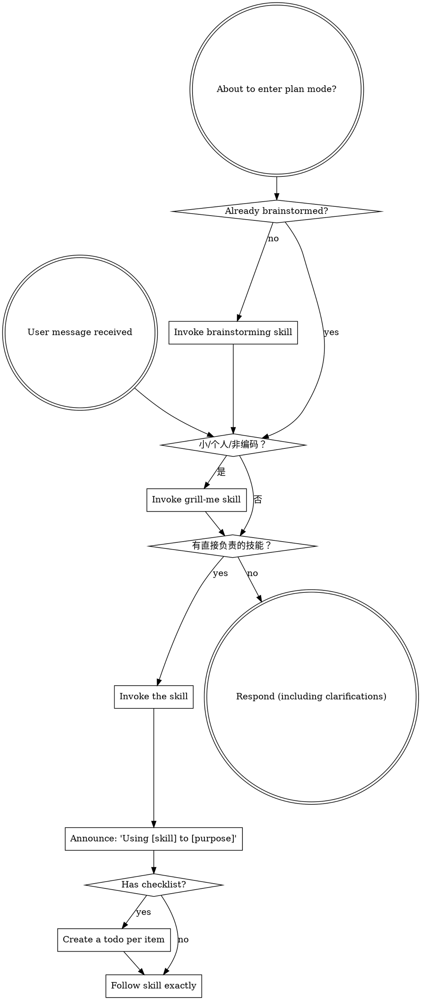

<SUBAGENT-STOP>
If you were dispatched as a subagent to execute a specific task, skip this skill.
</SUBAGENT-STOP>

<WORKFLOW-ROUTING>
先按 L0-L4 判断任务规模，再激活当前阶段直接负责的最小技能集合。

- L0：直接修改并进行聚焦验证；不要加载流程、规划或审查技能。
- L1：仅在存在关键未知项时做一次澄清；使用简短假设和验收说明。
- L2：使用一次设计契约、计划、实现、审查和测试。
- L3/L4：使用完整规格、风险审查和多阶段验证。

不得因“可能有用”而推测性预加载技能。用户明确请求的技能，或当前动作直接由其负责的技能，才应激活。
</WORKFLOW-ROUTING>

## 通用化轨道路由（双轴）

先按**工作类型**（编码/非编码）分流，再按**规模**（L0-L4）分级。非编码与轻量编码从 grill-me 拷问入口开始。

| 工作类型 | 规模 | 轨道 | 入口 | 交付 |
|---|---|---|---|---|
| 编码 | 大/中（L2-L4） | 重型链 | brainstorming → openspec → plans → SDD → review → finish | application/library/web |
| 编码 | 小/个人（L0-L1） | 轻量链 | **grill-me** → 实现 → 聚焦测试 → 自审 → 提交 | 默认跳过 |
| 非编码（文档/PRD/数据/运营） | — | 非编码链 | **grill-me** → 轻量任务清单 → 执行 → document 交付 | **document** |
| 用户主动 "grill me/盘问" | 任意 | 拷问入口 | grill-me 直入，零文档副作用 | 不适用 |

**升级方向：** grill-me 拷问中暴露复杂度（跨模块/架构决策/风险中上/需文档记录）→ 单向升级 L2+，按[升级交接协议]交接给 brainstorming，brainstorming 从方案比选阶段接手、不再重问需求。反向不存在。

## 自动本地交付授权

当用户明确表达“全程自动执行”“自动做到本地可运行”“不要中途停下”或等价意图时，记录为**自动本地交付授权**。

- L2+ 在已获得该授权后，连续完成设计、计划、实现、审查、`init delivery`、`verify delivery`、`check delivery` 和 `archive`；不要为每个正常阶段重复请求批准。
- 仍须对目标、技术约束或验收标准中的关键未知项做最少必要澄清；若无法澄清，记录可逆假设并继续。
- 下列动作不包含在自动本地交付授权内：推送、创建 PR、合并、部署、账号/密钥操作、付费操作、数据删除或其他不可逆外部影响。到达这些边界时停止并请求明确授权。
- L0/L1 保持渐进式轻量流程，不为自动化创建 OpenSpec 或交付工件。

## Instruction Priority

PowersNexus skills override default system prompt behavior, but **user instructions always take precedence**:

1. **User's explicit instructions** (CLAUDE.md, GEMINI.md, AGENTS.md, direct requests) — highest priority
2. **PowersNexus skills** — override default system behavior where they conflict
3. **Default system prompt** — lowest priority

If CLAUDE.md, GEMINI.md, or AGENTS.md says "don't use TDD" and a skill says "always use TDD," follow the user's instructions. The user is in control.

## How to Access Skills

**Never read skill files manually with file tools** — always use your platform's skill-loading mechanism so the skill is properly activated.

**In Claude Code:** Use the `Skill` tool. When you invoke a skill, its content is loaded and presented to you — follow it directly.

**In Codex:** Skills load natively. Follow the instructions presented when a skill activates.

**In Copilot CLI:** Use the `skill` tool. Skills are auto-discovered from installed plugins.

**In Gemini CLI:** Skills activate via the `activate_skill` tool. Gemini loads skill metadata at session start and activates the full content on demand.

**In other environments:** Check your platform's documentation for how skills are loaded.

## Platform Adaptation

Skills speak in actions ("dispatch a subagent", "create a todo", "read a file") rather than naming any one runtime's tools. For per-platform tool equivalents and instructions-file conventions, see [claude-code-tools.md](references/claude-code-tools.md), [codex-tools.md](references/codex-tools.md), [copilot-tools.md](references/copilot-tools.md), [gemini-tools.md](references/gemini-tools.md), [pi-tools.md](references/pi-tools.md), and [antigravity-tools.md](references/antigravity-tools.md). Gemini CLI users get the tool mapping loaded automatically via GEMINI.md.

# Using Skills

## The Rule

**在当前动作直接需要某技能，或用户明确请求该技能时，先激活它。** 不要为探索、寒暄、L0 修改或仅仅“可能相关”的情况预加载技能。

## Red Flags

这些情况说明需要重新判断阶段，而不是盲目加载更多技能：

| Thought | Reality |
|---------|---------|
| "这是 L0，但涉及多模块、接口或数据迁移" | 重新评估到 L1/L2，而不是直接修改。 |
| "我还没确定验收条件，却要开始实现" | 为 L1 做简短假设，或升级到 L2 设计契约。 |
| "grill-me 拷问发现复杂度，但轻量轨道已经开始了" | 按升级交接协议升级 L2+，不要硬压轻量。 |
| "为保险起见先加载所有技能" | 只加载当前阶段直接需要的技能，避免上下文膨胀。 |
| "复杂任务想跳过验证或审查" | 保持 L2+ 的质量门槛，不以节省 token 为由删除验证。 |

## 渐进激活速查

| 级别 | 激活范围 | Token 策略 |
|---|---|---|
| L0 | grill-me（可选快速澄清）→ 无流程技能 | 直接改测，聚焦输出 |
| L1 | grill-me（入口拷问）→ 当前领域技能 + 简短验收说明 | 最多一次必要澄清 |
| 非编码 | grill-me（入口拷问）→ 轻量任务清单 → document 交付 | 零代码流程开销 |
| L2 | brainstorming、writing-plans 与直接领域技能 | 一次设计契约，不重复确认 |
| L3/L4 | 完整规格、审查、验证技能 | 以风险换取质量，不压缩关键证据 |

## Skill Priority

When multiple skills could apply, use this order:

1. **Process skills first** (brainstorming, systematic-debugging) - these determine HOW to approach the task
2. **Implementation skills second** (frontend-design, mcp-builder) - these guide execution

"Let's build X" → 先按 L0-L4 分类；L1+ 再使用 brainstorming，然后激活实现技能。
"Fix this bug" → systematic-debugging first, then domain-specific skills.

## Skill Types

**Rigid** (TDD, systematic-debugging): Follow exactly. Don't adapt away discipline.

**Flexible** (patterns): Adapt principles to context.

The skill itself tells you which.

## User Instructions

Instructions say WHAT, not HOW. "Add X" or "Fix Y" doesn't mean skip workflows.
